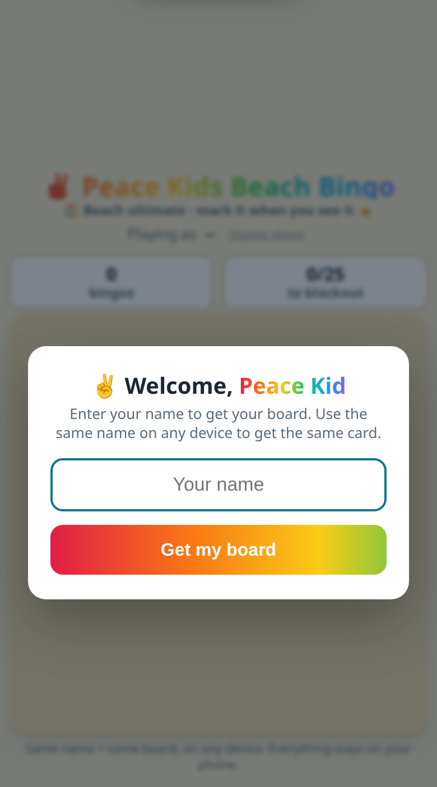
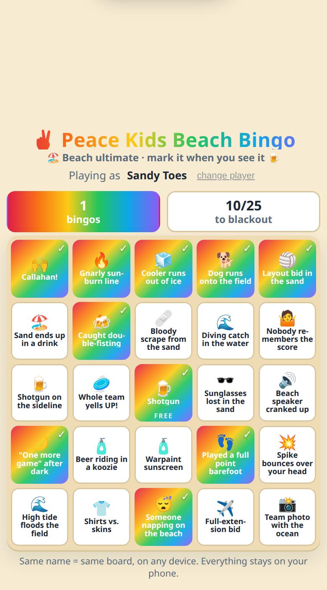
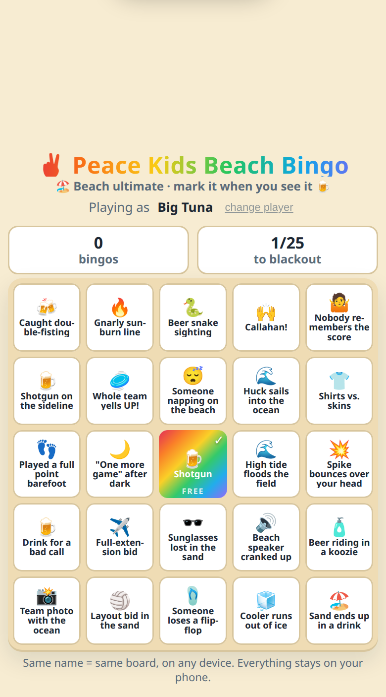

# Simple Online Bingo Card

A static, phone-first **distributed bingo** game for a group of friends. There is no
server and no account system: each player types their name, and their board is generated
**deterministically from that name**, so the same name always produces the same card, on
any device. Marking squares is saved locally. Everything stays on the player's phone.

Built for the **Peace Kids** beach ultimate team, but the content is just two arrays at the
top of `index.html`, so it re-themes to anything.

|            Welcome            |          A board (with a BINGO)          |     A different name, a different board     |
| :---------------------------: | :--------------------------------------: | :-----------------------------------------: |
|  |  |  |

## How it works

- The game has a **pool of prompts** (currently ~30). Each player gets a random **24-square
  subset** arranged on a 5×5 grid, with a fixed **FREE** square in the center.
- A player's name is normalized (`trim` → collapse spaces → `lowercase` → Unicode `NFC`) and
  hashed with **cyrb128** into a 128-bit seed. That seed drives an **sfc32** PRNG, which does
  a **Fisher-Yates** shuffle of the pool. Same name in → same board out, forever, everywhere.
- Because names seed the board, two people with the same name get the same card (intended),
  and one person always gets their card back on a new phone just by typing the same name.
- Tapping a square marks it. Marks are saved to `localStorage`, keyed by the normalized name.
- Two win readouts are tracked separately: **bingos** (completed rows / columns / diagonals)
  and **blackout** progress (`n/25`). Completing a fresh line pops a banner.
- The player's name is cached, so returning players skip straight to their board. A low-key
  **change player** link re-prompts (for a shared or borrowed phone).

Nothing is sent anywhere. No backend, no analytics, no cookies -- just `localStorage`.

## Changing the game (content)

Everything you'd want to edit lives in two blocks near the top of the `<script>` in
[`index.html`](./index.html):

```js
const CONFIG = {
  freeSpace: { text: "Shotgun", emoji: "🍺" }, // the center square
};

const PROMPTS = [
  { text: "Layout bid in the sand", emoji: "🏐" },
  // ... a prompt is a string, { text, emoji }, or { text, img: "file.png" }
];
```

- **Add/remove/reword squares:** edit `PROMPTS`. Any size **≥ 24** works; with more than 24,
  each player gets a random subset (cards differ in content *and* layout). At exactly 24,
  every card has the same items in different positions.
- **Images on squares:** drop a file in `images/` and reference it with
  `{ text: "Shotgun", img: "shotgun.png" }`. The build copies `images/` into the deploy.
- **Changing normalization is a breaking change:** it silently rebuilds everyone's board.
  Editing prompts only reshuffles; changing the name-normalization rules re-seeds. Avoid it.

## Local development

```bash
npm install      # first time only (installs wrangler)
npm run build    # regenerate public/
npm run preview  # build + serve public/ at http://localhost:8788 (python http.server)
npm run dev      # build + serve via wrangler (closest to production)
```

`public/` is generated (gitignored). Edit `index.html`, not `public/`.

## Deployment (Cloudflare Workers)

The site is a static-assets-only Cloudflare Worker named `peace-kids-bingo`. Every push to
`master` builds and deploys via Cloudflare's Git integration (Workers Builds), so `master`
is always what's live. Manual deploy: `npm run deploy`.

### One-time Cloudflare setup

Do this once in the Cloudflare dashboard to connect the GitHub repo:

1. **Dashboard → Workers & Pages → Create → Workers → Import a repository.** Authorize GitHub
   and pick `topher200/simple-online-bingo-card`. **Name the Worker `peace-kids-bingo`**
   (Cloudflare defaults to the repo name; it must match the `name` in `wrangler.jsonc`). The
   Worker name is what the `*.workers.dev` URL is built from, so the site goes live at
   `peace-kids-bingo.<account>.workers.dev`.
2. Set build settings:
   - **Build command:** `npm run build`
   - **Deploy command:** `npx wrangler deploy`
   - (Root directory: leave as repo root. Cloudflare runs `npm install` automatically.)
3. **Branch:** deploy on push to `master`.
4. Click **Create and deploy.** The first deploy gives a URL like
   `peace-kids-bingo.<your-account>.workers.dev`.
5. *(Optional)* Add a custom domain under the Worker's **Settings → Domains & Routes**.

After that, every push to `master` redeploys automatically.

## Repo structure

```
index.html        The whole game: CONFIG + PROMPTS, seeded PRNG, grid, persistence
images/           Optional per-square images (referenced via { img: "..." })
build.mjs         Copies index.html (+ images/) into public/
wrangler.jsonc    Cloudflare Workers static-assets config
public/           Build output (gitignored, deployed by wrangler)
screenshots/      README images
```

See [AGENTS.md](./AGENTS.md) for the edit-and-deploy workflow.
